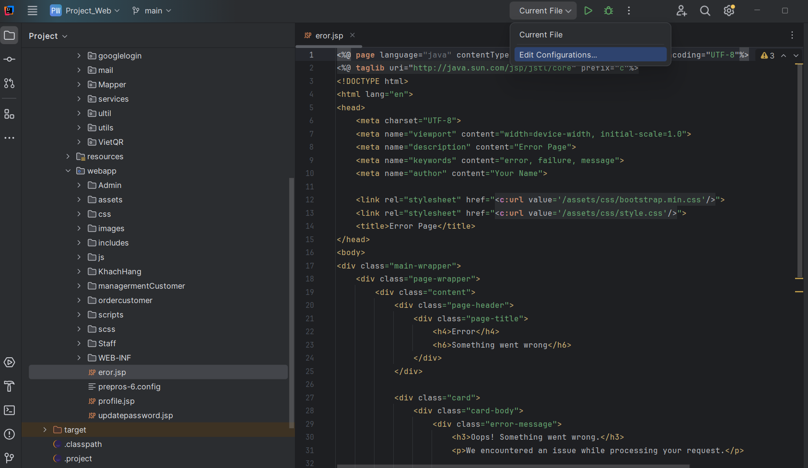
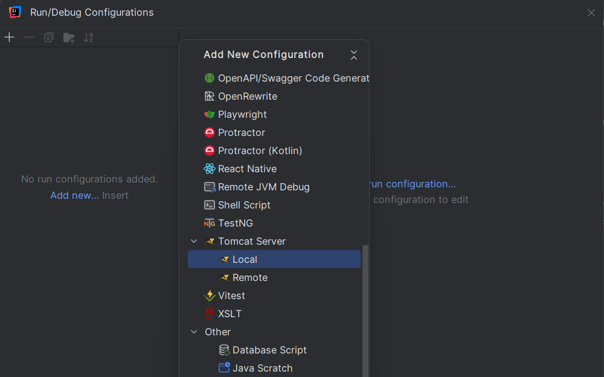
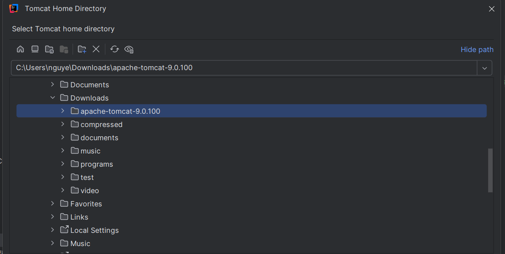
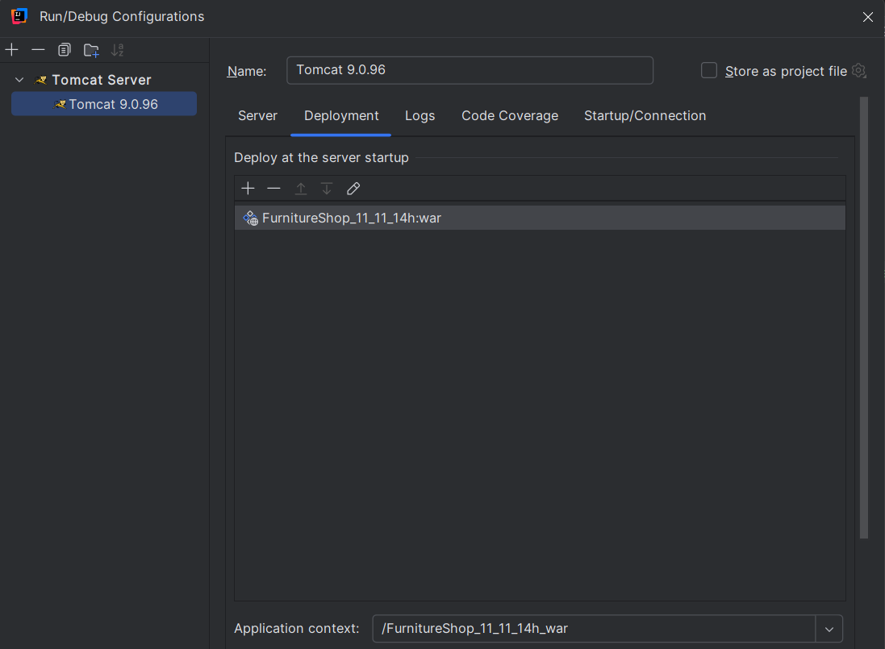
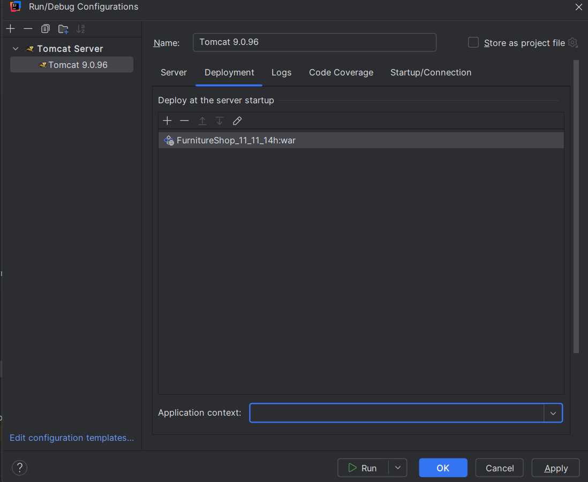
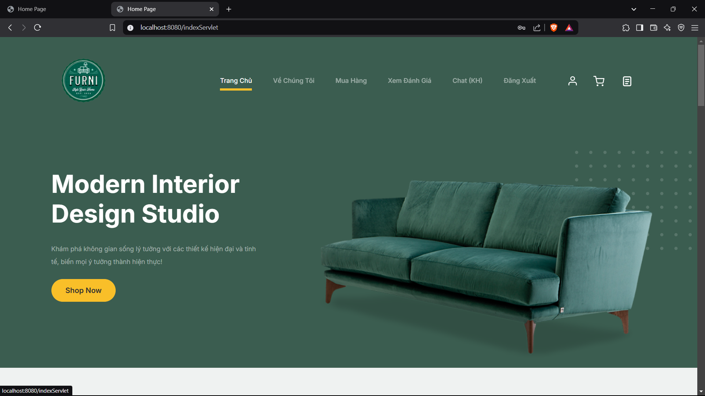

# Geting Started

FurniShop is a Java web application that requires several configurations before it can run properly. This guide will walk you through the necessary setup steps to get started.

## Install JDK

FurniShop is built on Java, so you need to have [JDK (Java Development Kit)](https://www.oracle.com/java/technologies/downloads/) installed globally on your machine.

The two most popular versions currently are **JDK 23 (latest version)** and **JDK 21 (LTS)**.

### Download JDK

Different JDK versions are available on Oracle's official website:

- [JDK 23 (Latest)](https://www.oracle.com/java/technologies/downloads/#java23).

- [JDK 21 (LTS)](https://www.oracle.com/java/technologies/downloads/#java21).

There are multiple ways to install JDK. However, for convenience and ease of use, we strongly recommend installing using the provided **installer** files.

> [!NOTE]
> We recommend using JDK 23 for verified compatibility.

After downloading, open the setup file and proceed with the installation as you would with any standard setup file.

In case you wish to change the installation directory, just make sure to note the new directory path.

### Configure Environment Variables

To allow the system to recognize JDK, you must configure environment variables.

#### Configure Environment Variables

1. By default, JDK is installed in:

   > `C:\Program Files\Java\jdk-23`

   or

   > `C:\Program Files\Java\jdk-21`

#### Set Up JAVA_HOME Variable

1. Open the Start Menu, type `Edit the system environment variables`, and press **Enter**.

2. Select **Environment Variables**.

3. Under System Variables, click New...:

- Variable name: **JAVA_HOME**

- Variable value: Enter the JDK installation path, for example:

  - `C:\Program Files\Java\jdk-23`

    > or

  - `C:\Program Files\Java\jdk-21`

4. Click OK to save.

#### Configure PATH Variable

1. In the Environment Variables window, find the Path variable under System Variables.

2. Select Path and click Edit....

3. Click New, then enter the path to the JDK bin directory:

- `C:\Program Files\Java\jdk-23\bin`

  > or

- `C:\Program Files\Java\jdk-21\bin`

4. Click OK.

#### Verify Configuration

After setting up, check if the system recognizes JDK:

1. Open PowerShell or Command Prompt.

2. Run the following command:

```bash
java -version
```

3. Expected output:

```bash
java version "23.0.x" or "21.0.x"
```

## Installing Tomcat

To deploy Java-based websites, specialized server configurations are required. For FurniShop, we use [Apache Tomcat](https://tomcat.apache.org/).

### Download Tomcat

Apache Tomcat is an open-source servlet container for deploying Java web applications. Different Tomcat versions are available on the Apache official website.

> [!IMPORTANT]  
> Since FurniShop is developed on **Tomcat 9**, you must use **Tomcat 9** for the application to function correctly.

1. Visit the [Tomcat 9 Download page](https://tomcat.apache.org/download-90.cgi).

2. Under **Binary Distributions**, download the `.zip` or `.tar`, `.gz` file corresponding to your operating system.

3. Extract the downloaded file to your preferred directory, e.g., `C:\Apache\Tomcat` on Windows.

> [!TIP]  
> Make sure to note the Tomcat directory path for later configuration steps.

### Configure Tomcat

Tomcat can be configured in multiple ways depending on the IDE you use. Refer to **Section 3.4.3 - Localhost Configuration**.

## Database Management System (DBMS) Configuration

> [!IMPORTANT]  
> FurniShop provides a pre-hosted MySQL database by default, so you are not required to set up a separate database to use the application! 🚀.

FurniShop uses **MySQL** as its database management system.

There are two MySQL versions:

- **MySQL Community Edition**: Free version (this is the one we will install).

- **MySQL Enterprise Edition**: A commercial version for enterprises.

The two essential components of MySQL Community are:

- **MySQL Server**: Runs the database

- **MySQL Workbench**: GUI tool for MySQL management

### Download MySQL

Download MySQL from the official website:

1. Visit [MySQL Downloads](https://dev.mysql.com/downloads/).

2. Download `MySQL Installer for Windows`.

3. Ensure you get `mysql-installer-community` NOT `mysql-installer-web-community`.

### Installation and Configuration

#### Run the Installer

1. Open the downloaded **MySQL Installer**.

2. Select **MySQL Server** and **MySQL Workbench**, then click **Next**.

3. Click **Execute** to start the installation process.

4. Set up a `username` and `password` when prompted.

#### Configure MySQL Server

After installation, MySQL is ready to use. However, if you need to change configurations:

1. Open **MySQL Installer**.

2. Select **MySQL Server**.

3. Click **Reconfigure**.

4. Apply desired configuration settings.

Step 3: Verify Installation

1. Open Command Prompt and run the following command to check MySQL Server:

   ```bash
   mysql -u root -p
   ```

2. Enter the password set in the previous step.

3. If installation was successful, the **MySQL CLI** will appear.

## IDE Configuration

FurniShop can run on various Java IDEs (NetBeans, Eclipse, etc.). However, we strongly recommend using [IntelliJ IDEA](https://www.jetbrains.com/idea/download/?section=windows).

> [!NOTE]  
> FurniShop was built with IntelliJ !.

## Installation and Running Locally

> [!NOTE]  
> **FurniShop** is already deployed online. You can join us at [FurniShop](https://furnitureshop-08gv.onrender.com/) ✨!

### Prerequisites

To clone this repo, you need Git installed on your machine, ofcourse !

### Installation

1. Navigate to your desired storage directory.

2. Open PowerShell or Terminal.

3. Run the following command:

   ```bash
   git clone https://github.com/Hiendang123a/Project_Web
   ```

### Open Project with IntelliJ

1. Open **IntelliJ IDEA**.

2. Click Open.

3. Select the project folder.

### Localhost Configuration

1. After opening the project, go to Current `File → Edit` Configurations.

<details>
<summary>Click to see image</summary>    
<pre>

</pre>
</details>

2. Click `Add New → Tomcat Server → Local`.

<details>
<summary>Click to see image</summary>    
<pre>

</pre>
</details>

3. Under Application Server, select `Config → Tomcat home` and browse to the Tomcat directory then click **OK**.

<details>
<summary>Click to see image</summary>    
<pre>

</pre>
</details>

4. Go to the **Deployment** tab.

<details>
<summary>Click to see image</summary>    
<pre>

</pre>
</details>

5. In Artifact, select **FurnitureShop_11_11_14h:war**, leave Application context empty.

<details>
<summary>Click to see image</summary>    
<pre>

</pre>
</details>

### Database Configuration

> [!TIP]  
> FurniShop by default uses a pre-hosted MySQL database. If you wanna use our DB, no more configuration is needed.

To use a different database, update persistence.xml:

```
src/main/resources/META-INF/persistence.xml
```

```xml
<property name="javax.persistence.jdbc.url" value="">
<property name="javax.persistence.jdbc.user" value="avnadmin"/>
...
<property name="javax.persistence.jdbc.password" value="AVNS_HaRzMLhIdgMhg30-SDc"/>
```

You will need to create a new database with **MySQL Workbench** and update the `url`, `user` and `password` accordingly.

### Run Locally

Simply click `Run` or `Ctrl + F5` to run the project. After deployment, IntelliJ will automatically open the browser and load localhost.

<details open>
<summary>Click to see image</summary>    
<pre>

</pre>
</details>
